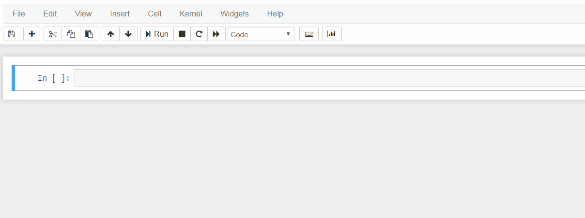

# Git Checkpoints
A simple implementation of Git Checkpoints for [Jupyter Notebook](https://github.com/jupyter/notebook) geared toward use with [JupyterHub](https://github.com/jupyterhub).



Git Checkpoints replaces the file-based default checkpointing system with a version control system based on **git**. Most checkpoint operations (create, rename, delete) are handled by simply committing the changed file and pushing to a remote repo, while the *Restore Checkpoint* feature is accomplished by listing checking out one of the last 10 commit hashes for the file.

# Installation
This package can be installed by cloning the repo and installing with pip:

```
git clone {this}
cd git_checkpoints
pip install .
```
## Requirements
This implementation assumes the use of a recent Jupyter Notebook release, an installation of Git in the system path with `git` callable from python and the Git wrapping package `brigit`

# Usage - Integrating with Jupyter Notebooks
In order to inform Jupyter to use this Checkpoint implementation over the default implementation, we update our `jupyter_notebook_config.py` to include

```python
import gitcheckpoints
c.ContentsManager.checkpoints_class = 'gitcheckpoints.GitCheckpoints'
```

## ENV VARS
This checkpoint implementation expects some environment variables to configure its behaviour. The required variables are:

```
DEPLOY_ENV=#an env name for naming branches, useful if hosting multiple users in multiple environments in the same repo

# Required for local install:
DEBUG_HOME=#where to initialize the git repo, defaults to os.environ['HOME']
```

Git Checkpoints also expects that information about git config are passed in as environment variables. If these are not passed in, Git Checkpoints will function locally, without pushing to a remote repo. In order to push to the repo, provide:

```
# Git config, used to construct URL to remote. If not provided, operate without remote
GIT_USER=#git username
GIT_PASS=#password
GIT_EMAIL=#some email
GIT_URL=#remote url
```


## Advanced Usage
With the basic git checkpointing system in place, users will be able to directly interact with git in order to create/change/merge branches, point to custom remote endpoints, while leveraging the integrated commit/push functionality of Jupyter Notebook's *Save and Checkpoint* as well as *Restore Checkpoint*. Users should be careful when altering the default branches as merge conflicts can and will become an issue that must be handled in the normal way.